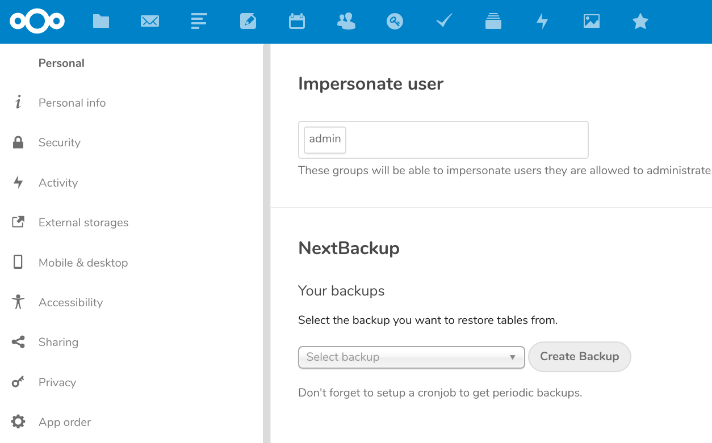

# [OwnBackup](https://apps.owncloud.com/content/show.php?content=170674 "OwnBackup ownCloud App page") 

[Changelog](https://github.com/pbek/ownbackup/blob/develop/CHANGELOG.md) | 
[Issues](https://github.com/pbek/ownbackup/issues) | 
[Download](https://github.com/pbek/ownbackup/releases) |
[ownCloud Marketplace page](https://marketplace.owncloud.com/apps/ownbackup) |
[Nextcloud Apps page](https://apps.nextcloud.com/apps/ownbackup)

[](https://travis-ci.org/pbek/ownbackup)
[](https://codeclimate.com/github/pbek/ownbackup)
[](https://codeclimate.com/github/pbek/ownbackup/coverage)
[](https://insight.sensiolabs.com/projects/04f33cd9-67b9-4a88-92d0-0c98944d1a8f)


**OwnBackup** is the **simple database backup solution** for your **[ownCloud](http://www.owncloud.org/)** 8.1+
and **[Nextcloud](http://www.nextcloud.com/)** installation.

Its main purpose is to provide an easy solution to restore the tables of an app in case you accidentally corrupted the data or did anything you regret later.  

## Installation

Clone the app into your Nextcloud / ownCloud apps directory:

```bash
git clone https://github.com/pbek/ownbackup.git apps/ownbackup -b master
```

Activate the app:

```bash
occ app:enable ownbackup
```

## Screenshot


## Features

- OwnBackup creates backups of your Nextcloud / ownCloud tables hourly via cronjob or manually.
- You are able to choose which tables from a certain backup you want to restore.
- OwnBackup expires your backups automatically.
    - for 24h one backup every hour is kept
    - for 7d one backup per day is kept
    - for 4w one backup per week is kept
    - for 12m one backup per 30d is kept
    - for 2y one backup per year is kept
- If the Zlib library is present the backups get compressed with gzip.
- The backup should work with all databases, please report any problems. 

## Limitations

- I've only tested the app with [Cron](https://docs.nextcloud.com/server/stable/admin_manual/configuration_server/background_jobs_configuration.html#cron) so far, please report any troubles with *Webcron* or *AJAX*.
- One main limitation for the size that your DB can have to be backed up will be the `memory_limit` and the `max_execution_time` of your PHP installation!

## Disclaimer

- Use this app at your own risk! Data loss may occur!
- This app is no replacement for a more professional backup solution!
- This software is not affiliate with [www.ownbackup.com](https://www.ownbackup.com/), I'm sorry for the name clash.

This SOFTWARE PRODUCT is provided by THE PROVIDER "as is" and "with all faults." THE PROVIDER makes no representations or warranties of any kind concerning the safety, suitability, lack of viruses, inaccuracies, typographical errors, or other harmful components of this SOFTWARE PRODUCT. 

There are inherent dangers in the use of any software, and you are solely responsible for determining whether this SOFTWARE PRODUCT is compatible with your equipment and other software installed on your equipment. You are also solely responsible for the protection of your equipment and backup of your data, and THE PROVIDER will not be liable for any damages you may suffer in connection with using, modifying, or distributing this SOFTWARE PRODUCT.
